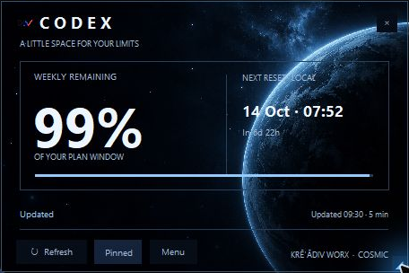

# Usage Card for Codex

A little space for your limits. A resizable Windows desktop card by **Krēˈādiv Worx**, with a local Codex skill plugin. MIT open source. Version **0.4.0**, 7 October 2026 — public beta.

Cosmic blue planet artwork, a large remaining percentage, local reset dates and a blue progress line. Drag it into place, resize it, pin it or refresh on demand. Shows only plan windows returned by Codex; failed refreshes keep the previous reading marked Stale. Percentages describe plan capacity, not monetary credits.



## Download and run

Download **Usage-Card-for-Codex-v0.4.0-windows.zip** from the [release page](https://github.com/blackstackdev/codex-usage-card/releases/tag/v0.4.0), extract it, then double-click **Launch Widget.vbs**. Alternatively run `python widget.py` from that folder.

Requires Windows, **Python 3.11+ with Tcl/Tk**, `pythonw.exe` on PATH for the launcher, and a signed-in **Codex CLI executable**. The installed desktop app's Codex executable is detected automatically; a `codex.exe` on PATH also works. npm `.cmd` shims are unsupported. No third-party Python packages are needed. This is a script package, not a bundled executable or installer.

## Controls and startup

- Drag the header/background to move; drag the **lower-right corner** to resize from 360×240 to 960×640. Artwork, text and controls scale proportionally. Width is saved.
- **Menu → Size** offers Small, Default and Large. Ctrl+= enlarges; Ctrl+- shrinks.
- **Pin** / Ctrl+P keeps it above windows. **Refresh** / Ctrl+R reads current limits. Automatic refresh is five minutes. **Menu** / Ctrl+M includes reset details and About. **×** / Escape closes.
- There is no conventional taskbar/minimize entry. One Cosmic instance runs per Windows session.

**Startup is off by default.** Enable **Menu → Launch at Windows sign-in** to open the card after logging into this Windows account. It copies the app to a stable local app-data folder (`kreadiv-worx\CodexUsageCosmic\app`) and creates a dedicated `Kreadiv Worx Cosmic Usage.vbs` entry in your Startup folder. Turning the option off removes only this marked entry; the installed copy stays available. No administrator rights or scheduled task are needed.

To update a startup-enabled copy: close the running card, extract the new package, run `python cosmic.py --enable-startup` there and relaunch. To disable from the terminal, use `python cosmic.py --disable-startup`.

The older v0.3.0 compact card and its preferences are preserved. Cosmic uses separate preferences and a separate instance guard; close the older card if you only want one on your desktop.

## Local Codex plugin

The plugin supplies **“Show my Codex plan limits”** and **“Open my Codex usage card.”** Its helper runs locally; no MCP server or cloud backend is included. Neither helper action enables startup.

Using Codex CLI 0.160.1 or another version supporting `plugin marketplace`:

```powershell
codex plugin marketplace add blackstackdev/codex-usage-card --ref v0.4.0
codex plugin add codex-usage-card@kreadiv-usage-card
```

Use the full Codex executable path if it is not on PATH. Open a new Codex chat and select Usage Card for Codex in the plugin picker. The **codex-usage-card-v0.4.0-plugin.zip** asset is also self-contained for hosts accepting local packages. GitHub marketplace installation uses `.agents/plugins/marketplace.json`. A previously installed marketplace pinned to v0.3.0 needs its ref updated and plugin reloaded through the host's supported flow.

## Data and limitations

The card launches the installed Codex app-server, reads `account/rateLimits/read`, then closes it. Codex handles the existing sign-in and server request. The card does not read auth files, run model turns, connect a new account or redeem reset credits. Position, pin and width are saved in the local `CodexUsageCosmic\settings.json`; installed copies anchor preferences next to their app folder. [Privacy details](PRIVACY.md).

Shared account limits are snapshots. The CLI account can differ from the desktop account after an account switch. The protocol is experimental. Windows desktop only; generated artwork without a blurred desktop backdrop. Independent of OpenAI.

Tested on one Windows PC with Python 3.11.9 / Tk 8.6 / Codex CLI 0.160.1. Native pointer/keyboard checks exercised resize and saved-size reload. The actual startup entry was executed and duplicate launch checked. Full reboot/sign-out, other DPI/monitors, screen readers, sleep/resume and long unattended use remain unverified. [Verification details](docs/VERIFICATION.md).

## Development

```powershell
python -m unittest discover -s plugins/codex-usage-card/app/tests -v
python -m unittest discover -s tests -v
python plugins/codex-usage-card/app/widget.py --smoke
python plugins/codex-usage-card/scripts/usage.py status
python scripts/package.py
```

Report issues in [GitHub Issues](https://github.com/blackstackdev/codex-usage-card/issues), without personal data. [Changelog](CHANGELOG.md) · [MIT license](LICENSE) · [Artwork provenance](docs/ARTWORK.md).
